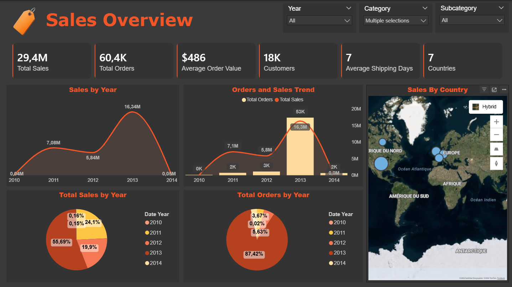

# Data Warehouse and Analytics Project

Welcome to the **Data Warehouse and Analytics Project** repository! 🚀  
This project demonstrates a data warehousing and analytics solution, from building a data warehouse to generating actionable insights. Designed as a portfolio project, it highlights industry best practices in data engineering and analytics.

---
## 🏗️ Data Architecture

The data architecture for this project follows Medallion Architecture **Bronze**, **Silver**, and **Gold** layers:

1. **Bronze Layer**: Stores raw data as-is from the source systems. Data is ingested from CSV Files into SQL Server Database.
2. **Silver Layer**: This layer includes data cleansing, standardization, and normalization processes to prepare data for analysis.
3. **Gold Layer**: Houses business-ready data modeled into a star schema required for reporting and analytics.

---
## 📖 Project Overview

This project involves:

1. **Data Architecture**: Designing a Modern Data Warehouse Using Medallion Architecture **Bronze**, **Silver**, and **Gold** layers.
2. **ETL Pipelines**: Extracting, transforming, and loading data from source systems into the warehouse.
3. **Data Modeling**: Developing fact and dimension tables optimized for analytical queries.
4. **Analytics & Reporting**: Creating SQL-based reports and dashboards for actionable insights.

---

## 🚀 Project Requirements

### Building the Data Warehouse (Data Engineering)

#### Objective
Develop a modern data warehouse using SQL Server to consolidate sales data, enabling analytical reporting and informed decision-making.

#### Specifications
- **Data Sources**: Import data from two source systems (ERP and CRM) provided as CSV files.
- **Data Quality**: Cleanse and resolve data quality issues prior to analysis.
- **Integration**: Combine both sources into a single, user-friendly data model designed for analytical queries.
- **Scope**: Focus on the latest dataset only; historization of data is not required.
- **Documentation**: Provide clear documentation of the data model to support both business stakeholders and analytics teams.

---

## 📈 BI: Analytics & Reporting (Data Analysis)

### Overview
An interactive **Power BI dashboard** was developed to analyze key business metrics using SQL-based data transformations.  
The dashboard provides actionable insights into:

- **Customer Behavior**
- **Product Performance**
- **Sales Trends**

These insights help stakeholders monitor performance, identify trends, and support data-driven decision making.

### Dashboard Preview [(Link)](https://app.powerbi.com/view?r=eyJrIjoiNjMyOWNiMWEtZjg5ZS00MGNkLTk0MDYtMjgzOWFiZmYxZDM4IiwidCI6ImRiZDY2NjRkLTRlYjktNDZlYi05OWQ4LTVjNDNiYTE1M2M2MSIsImMiOjl9)

### Key Features
- KPI overview for sales performance
- Product-level performance analysis
- Customer purchasing behavior insights
- Time-based sales trend analysis
- Interactive filtering for deeper exploration

### Tools Used
- **Power BI** – Data visualization and dashboard creation  

---

## 🛡️ License

This project is licensed under the [MIT License](LICENSE). You are free to use, modify, and share this project with proper attribution.
